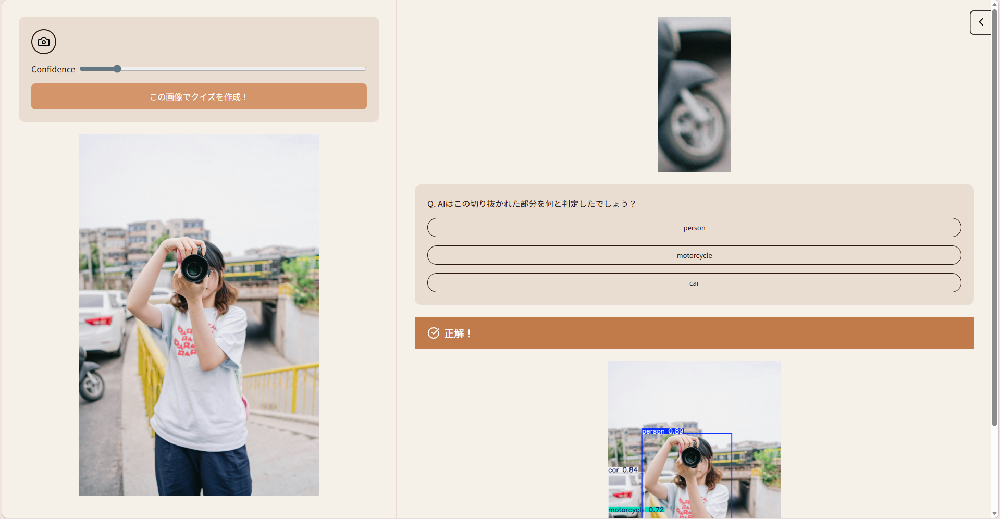
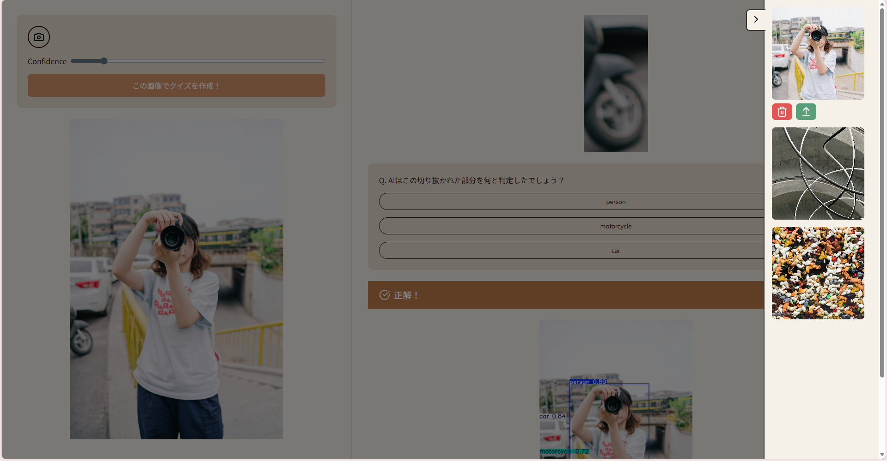

# YOLO Low Confidence Quiz 🤖❓
**AIのものの見方がわかる、物体検出クイズアプリ**

AIによる画像認識は、独自の特徴量に基づいて処理を行うため、時に人間には理解しがたい「勘違い」をすることがあります。
このアプリは、スライダー操作でAIの判断基準（信頼度）をあえて緩めることで、AIが当てずっぽうな推論を始めたり、小さなノイズに過剰反応したりする様子をクイズ形式で体験できます。

👉 **デモアプリはこちら: [http://54.236.168.14:3000/](http://54.236.168.14:3000/)**

---

## 📸 スクリーンショット




---

## 🎯 目的

Streamlitで開発した同アプリを、**FastAPI + React**で作り直しました。

「手軽に遊べる画像検出」というコンセプトはそのままに、Web開発の基本であるHTTP通信・REST API設計・フロントとバックの分離を実際に手を動かして学ぶことを目的としています。

---

## 🛠 技術スタック

| 領域 | 技術 |
|------|------|
| フロントエンド | React + Vite |
| バックエンド | FastAPI |
| 物体検出 | YOLOv8n (Ultralytics) |
| データベース | PostgreSQL + SQLAlchemy |
| インフラ | Docker Compose / AWS EC2 |

### 技術選定の理由

**FastAPI**
PythonベースでYOLOとの親和性が高く、Pydanticによる型安全なAPIレスポンスの定義、Swagger UIによる自動ドキュメント生成が開発効率を高めました。

**React + Vite**
コンポーネント単位の状態管理を学ぶために採用しました。`useState`や`useRef`を使ったUIの状態管理、`fetch`を使ったHTTP通信の仕組みを理解することが目的です。

**Docker Compose**
backend / frontend / db の3コンテナ構成で、環境差異をなくし再現性のある開発環境を実現しました。

---

## 🏗 設計思想

### REST API設計（CRUD）

画像リソースに対してCRUDを意識したエンドポイントを設計しました。

| メソッド | エンドポイント | 説明 |
|----------|---------------|------|
| POST | `/detect` | 画像を推論してクイズデータを返す |
| POST | `/images` | 画像をサーバーに保存しDBに記録 |
| GET | `/images` | 保存済み画像一覧を取得 |
| GET | `/images/{id}/file` | 特定の画像ファイルを取得 |
| DELETE | `/images/{id}` | 画像を削除 |
| PUT | `/images/{id}` | 画像の並び順を更新 |

### コンポーネント設計

単一責務の原則に基づき、アーカイブ機能を`ArchivePanel`コンポーネントとして分離しました。親コンポーネント（`App`）から`setImage`・`setImageUrl`などのstate更新関数をpropsとして渡すことで、コンポーネント間の状態共有を実現しています。

---

## 🎮 機能詳細

### クイズ生成ロジック
- YOLOv8nで画像内の全物体を検出
- 検出物体の中から「最も個数が少なく」かつ「最も信頼度が低い」物体をターゲットに選択
- 誤答の選択肢は「同じ画像内に写っている他の物体」から優先的に選択（候補不足時は全オブジェクト名から補完）

### アーカイブ機能
- 推論に使った画像をPostgreSQLに記録
- スライドインパネルで画像一覧を表示
- 過去の画像を選択して再クイズ・削除が可能

### 画像配信の最適化
当初は画像をbase64エンコードしてJSONで返していましたが、`FileResponse`を使ってファイルを直接配信する方式に変更しました。一覧取得のレスポンス速度が大幅に改善されました。

---

## 🚀 工夫した点

- **エラーハンドリング:** 検出数ゼロ時に422を返し、フロントでユーザーに「信頼度を下げてください」と案内
- **状態のリセット:** クイズ生成時に前回の回答・エラーを自動リセット
- **環境変数管理:** DBの接続情報を`.env`で管理し、Gitに含めない設計
- **スマホ対応:** `accept="image/*"`でカメラ撮影に対応、レスポンシブレイアウト

---

## 📋 今後の課題

- **ユーザー認証:** 現状は全ユーザーが同じDBを共有しているため、認証機能の追加が必要
- **ページネーション:** 画像が増えると一覧取得が重くなるため、`GET /images?page=1&limit=20`のような実装が必要
- **画像の自動削除:** サーバーストレージが増え続ける問題の解決
- **並び替え機能のフロント実装:** `PUT /images/{id}`のエンドポイントは実装済み

---

## 🏃 ローカルでの起動方法

```bash
git clone https://github.com/your-username/yolo-quiz-fastapi.git
cd yolo-quiz-fastapi

# .envファイルを作成
cp .env.example .env  # 各自の環境に合わせて編集

# 起動
docker compose up -d --build
```

ブラウザで `http://localhost:3000` にアクセス

---

## 👨‍💻 Author

Yuma Shudo